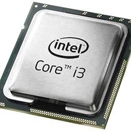
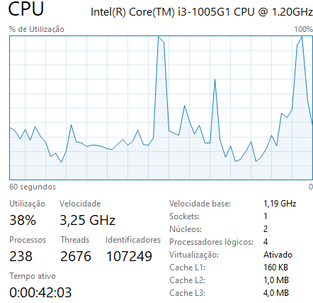

# Intel Core i3-1005G1

---

### historia do Intel Core i3-1005G1

#### O Intel Core i3-1005G1 não era apenas mais um processador, mas uma história de inovação e dedicação dos engenheiros da Intel. Sua criação refletiu o compromisso contínuo da Intel em impulsionar a tecnologia de processadores, oferecendo soluções que melhoram a vida das pessoas em todo o mundo. E assim, o Intel Core i3-1005G1 encontrou seu lugar no mercado, ajudando a alimentar a revolução da computação pessoal com desempenho e eficiência notáveis.

---

### Informações

#### Imagem processador 
  
  
> Os modelos mais atuais aguentam 16 GB e 32 GB de memória RAM. Os de primeira geração tem suporte oficial para até 8GB e 16GB.

| Processador | Bits |
| ----------- | ----------- |
| Intel Core i3-1005G1 | 64 |

| Processador | Velocidade |
| ----------- | ----------- |
| Intel Core i3-1005G1 | 1,19 GHz |

| Ghz | Hz |
| ----------- | ----------- |
|  1,19 GHz | 1,19 Bilhões |

| Hz | Ciclos |
| ----------- | ----------- |
|  1,19 Bilhões | 1,19 Bilhões |

---

#### Imagem CPU

