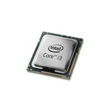
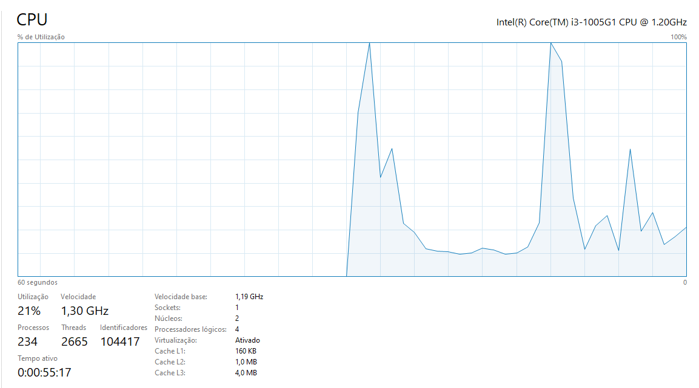

# Intel core i3

#### Intel core i3 é um processador onde possui 64 bits, Maximo é  7.7 GB de RAM e 12 000 000 00 hz, logo são 12 000 000 00 de ciclos por segundos

#### Imagem processador 
  
#### Imagem CPU
